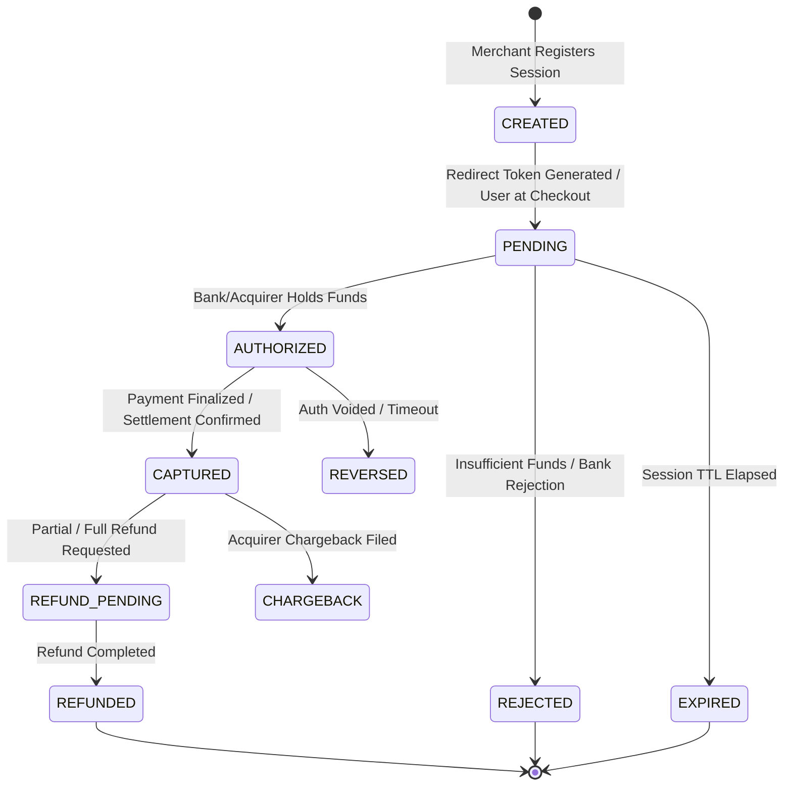
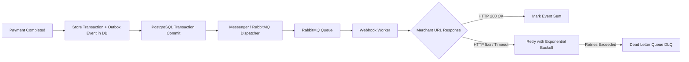
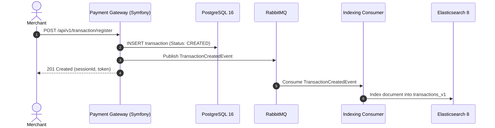

# Demo Payment Gateway — Przelewy24 / Nexi Group Architecture Blueprint

A production-grade reference demo designed for the **PHP Developer (Przelewy24 & Polskie ePłatności / Nexi Group)** role.

This repository demonstrates the domain challenges, clean architectural principles, and technology stack required to build, scale, and maintain high-volume payment processing systems.

---

## 📑 Table of Contents

- [1. Domain Overview & Business Context](#1-domain-overview--business-context)
- [2. Key Domain Problems & Architectural Solutions](#2-key-domain-problems--architectural-solutions)
  - [Transaction State Machine](#transaction-state-machine)
  - [Idempotency & Concurrency Control](#idempotency--concurrency-control)
  - [Cryptographic Integrity (CRC / HMAC Signatures)](#cryptographic-integrity-crc--hmac-signatures)
  - [Reliable Asynchronous Webhooks & Outbox Pattern](#reliable-asynchronous-webhooks--outbox-pattern)
  - [Clean Architecture & SOLID Boundaries](#clean-architecture--solid-boundaries)
- [3. Deep Dive: Elasticsearch in Payment Systems](#3-deep-dive-elasticsearch-in-payment-systems)
  - [Why Elasticsearch alongside PostgreSQL?](#why-elasticsearch-alongside-postgresql)
  - [Use Case 1: Merchant & Back-Office High-Speed Search](#use-case-1-merchant--back-office-high-speed-search)
  - [Use Case 2: Real-time Anti-Fraud & Risk Engine](#use-case-2-real-time-anti-fraud--risk-engine)
  - [Use Case 3: Live Aggregations & Conversion Analytics](#use-case-3-live-aggregations--conversion-analytics)
  - [Use Case 4: Tamper-Evident Audit Logging](#use-case-4-tamper-evident-audit-logging)
  - [Asynchronous Indexing Architecture (CDC / Messenger)](#asynchronous-indexing-architecture-cdc--messenger)
- [4. Tech Stack & Infrastructure](#4-tech-stack--infrastructure)
- [5. Quickstart & Development Environment](#5-quickstart--development-environment)
- [6. Project Roadmap & Planned Features](#6-project-roadmap--planned-features)

---

## 1. Domain Overview & Business Context

**Przelewy24 (PayPro SA)** and **Polskie ePłatności (PeP)** (part of the pan-European **Nexi Group**) operate mission-critical payment infrastructure serving over 150,000 merchants and processing millions of transactions daily across 400+ payment methods (BLIK, Pay-By-Link, Cards, Apple Pay, Google Pay, BNPL).

### Core Non-Functional Requirements in PSPs:
1. **High Availability (99.99%+) & Zero Downtime**: Payment pipelines must never lose a customer transaction, even during peak events (e.g., Black Friday).
2. **Sub-second Latency**: Authorization and redirection flows must respond within milliseconds.
3. **Data Integrity & Immutability**: Financial transactions must be strictly auditable and tamper-proof.
4. **Resiliency & Eventual Consistency**: Asynchronous reconciliation with external acquirers, banks, and merchant callbacks.

---

## 2. Key Domain Problems & Architectural Solutions

### Transaction State Machine

A payment transaction is an append-only, state-driven lifecycle. Invalid state transitions (e.g. attempting to capture an already refunded or failed transaction) are strictly guarded at the domain aggregate level.



---

### Idempotency & Concurrency Control

In distributed payment gateways, network timeouts and retries frequently cause duplicate API calls. 

- **Idempotency Keys**: Merchants supply a unique `Idempotency-Key` header with transaction registration requests.
- **Distributed Locks**: Redis-backed distributed locks (`Symfony Lock` / Redlock algorithm) prevent race conditions when concurrent status notifications arrive for the same payment session.
- **Pessimistic vs Optimistic Locking**:
  - *PostgreSQL*: Optimistic locking with version columns (`@ORM\Version`) on transaction aggregates.
  - *Redis*: Key leasing during incoming notification processing.

---

### Cryptographic Integrity (CRC / HMAC Signatures)

Security against parameter tampering during client redirects and server-to-server notifications:

- **Registration Signature**: `SHA-384(sessionId + merchantId + amount + currency + crcKey)`
- **Notification Verification**: Incoming notifications from banks/methods are verified against expected cryptographic hashes before triggering internal state transitions.

---

### Reliable Asynchronous Webhooks & Outbox Pattern

When a payment completes, the merchant's endpoint (IPN - Instant Payment Notification) must be notified reliably.



---

### Clean Architecture & SOLID Boundaries

The codebase separates pure domain rules from framework and infrastructure code:

```
src/
├── Domain/                  # Pure PHP, zero external dependencies
│   ├── Model/               # Transaction, Merchant, Money (Value Object), Currency
│   ├── Event/               # PaymentAuthorizedEvent, PaymentCapturedEvent
│   ├── Exception/           # InvalidStateTransitionException, ChecksumMismatchException
│   └── Repository/          # TransactionRepositoryInterface
├── Application/             # Use cases, Command & Query handlers (CQRS)
│   ├── Command/             # RegisterTransactionCommand, ProcessNotificationCommand
│   ├── Query/               # GetTransactionStatusQuery, SearchTransactionsQuery
│   └── DTO/                 # Request/Response data transfers
├── Infrastructure/          # Adapters, Framework integrations, DB, Messaging, Elasticsearch
│   ├── Persistence/         # Doctrine ORM Repositories & PostgreSQL Mappings
│   ├── Messaging/           # RabbitMQ Messenger Handlers & Outbox Publisher
│   ├── Elasticsearch/       # ES Client, Indices, Transformers & Query Builders
│   └── Security/            # CRC / HMAC Signature Calculators
└── UI/                      # Delivery mechanisms
    ├── Http/Rest/           # Payment Gateway API Controllers
    └── Cli/                 # Symfony Console Commands (Reconciliation, Re-indexing)
```

---

## 3. Deep Dive: Elasticsearch in Payment Systems

Elasticsearch plays a central, specialized role in modern fintech architectures alongside relational databases (PostgreSQL/MySQL).

### Why Elasticsearch alongside PostgreSQL?

| Feature | PostgreSQL / Relational DB | Elasticsearch (Distributed Search & Analytics) |
| :--- | :--- | :--- |
| **Primary Role** | ACID Source of Truth, OLTP, state consistency | Real-time Search, OLAP analytics, Audit logs, Risk |
| **Complex Filters** | B-Tree indexes degrade on multi-attribute combinatorial filters | Inverted index & BKD trees excel at multi-facet queries |
| **Aggregations** | Expensive `GROUP BY` across millions of transactions | Distributed, near-instant sub-second bucket/metric aggregations |
| **Full-Text Search** | Basic / slower on large volumes | Analyzers, tokenizers, n-grams, fuzzy matching |
| **Horizontal Scale** | Vertical scaling or complex sharding | Native clustering, horizontal sharding & replication |

---

### Use Case 1: Merchant & Back-Office High-Speed Search

Merchants and customer support agents need to search through hundreds of millions of historical transactions by:
- Masked card number / PAN (`411111******1111`)
- Customer email or billing name
- Order ID, Merchant Session ID, or Bank Reference
- Date range, status list, currency, payment method (BLIK, card, transfer)

#### Example Elasticsearch Mapping (`transactions_v1`):
```json
{
  "mappings": {
    "properties": {
      "id": { "type": "keyword" },
      "session_id": { "type": "keyword" },
      "merchant_id": { "type": "keyword" },
      "amount": { "type": "long" },
      "currency": { "type": "keyword" },
      "status": { "type": "keyword" },
      "payment_method": { "type": "keyword" },
      "customer": {
        "properties": {
          "email": { "type": "text", "fields": { "keyword": { "type": "keyword" } } },
          "name": { "type": "text" },
          "ip_address": { "type": "ip" }
        }
      },
      "created_at": { "type": "date" },
      "updated_at": { "type": "date" },
      "tags": { "type": "keyword" }
    }
  }
}
```

---

### Use Case 2: Real-time Anti-Fraud & Risk Engine

Payment gateways monitor transaction streams in real-time to block fraudulent attempts before authorization. Elasticsearch powers rapid heuristic scoring:

1. **Velocity Checks**: *Has this IP address or card fingerprint attempted > 5 transactions in the last 60 seconds?*
2. **Geo-velocity Anomaly**: *Was a payment authorized from Warsaw, and 3 minutes later another attempted from another country?*
3. **Card-Testing Attack Detection**: *Sudden burst of 1 PLN authorizations from sequential BINs.*

#### Example Velocity Query:
```json
{
  "query": {
    "bool": {
      "filter": [
        { "term": { "customer.ip_address": "195.150.9.37" } },
        { "range": { "created_at": { "gte": "now-1m" } } }
      ]
    }
  }
}
```

---

### Use Case 3: Live Aggregations & Conversion Analytics

Powering live merchant dashboards showing:
- Real-time conversion rate per payment method (BLIK vs Cards vs Pay-By-Link).
- Hourly gross merchandise value (GMV) breakdown.
- Bank channel error spikes (e.g. Bank X rejecting authorizations).

#### Example Hourly GMV Aggregation Query:
```json
{
  "size": 0,
  "query": {
    "bool": {
      "filter": [
        { "term": { "merchant_id": "M_100234" } },
        { "term": { "status": "CAPTURED" } },
        { "range": { "created_at": { "gte": "now-24h" } } }
      ]
    }
  },
  "aggs": {
    "transactions_over_time": {
      "date_histogram": {
        "field": "created_at",
        "calendar_interval": "1h"
      },
      "aggs": {
        "total_volume": {
          "sum": { "field": "amount" }
        },
        "by_method": {
          "terms": { "field": "payment_method" }
        }
      }
    }
  }
}
```

---

### Use Case 4: Tamper-Evident Audit Logging

Every state transition, webhook attempt, and operator action produces an immutable audit event stored in Elasticsearch indices with automated rollover policies (ILM - Index Lifecycle Management).

---

### Asynchronous Indexing Architecture (CDC / Messenger)

To maintain maximum OLTP throughput, transactions are written to PostgreSQL first. An asynchronous worker feeds Elasticsearch via RabbitMQ:



---

## 4. Tech Stack & Infrastructure

- **Language & Framework**: PHP 8.2+ / Symfony 7
- **Database (Relational / OLTP)**: PostgreSQL 16.6 (`postgres:16.6-alpine`)
- **Cache & Distributed Locks**: Redis 7 (`redis:7`)
- **Message Broker & Queues**: RabbitMQ 3 Management (`rabbitmq:3-management-alpine`)
- **Search & Analytics Engine**: Elasticsearch 8.15 (`elasticsearch:8.15.0`)
- **Web Server**: Nginx (`nginx:alpine`)
- **Testing & Quality Assurance**: PHPUnit, Codeception, PHPStan, PHP-CS-Fixer

---

## 5. Quickstart & Development Environment

### Prerequisites
- Docker & Docker Compose
- Make (optional, for CLI shortcuts)

### 1. Start Docker Containers
```bash
docker compose up -d --build
```

### 2. Verify Running Services
```bash
docker compose ps
```

| Service | Host Port | Purpose | Credentials |
| :--- | :--- | :--- | :--- |
| **Web API (Nginx)** | `http://localhost:8080` | Symfony 7 Gateway API | - |
| **PostgreSQL** | `localhost:5432` | Relational Storage | `przelewy_user` / `przelewy_pass` (`przelewy_db`) |
| **RabbitMQ UI** | `http://localhost:15672` | Queue Management Dashboard | `guest` / `guest` |
| **Elasticsearch** | `http://localhost:9200` | Search & Analytics Cluster | Security disabled for dev |
| **Redis** | `localhost:6379` | Cache & Distributed Lock Store | - |

---

### 3. Test Elasticsearch Cluster Health
```bash
curl http://localhost:9200/_cluster/health?pretty
```

Expected output:
```json
{
  "cluster_name" : "docker-cluster",
  "status" : "green",
  "number_of_nodes" : 1,
  "number_of_data_nodes" : 1
}
```

---

### 4. Useful Development Commands

```bash
# Execute Symfony console commands inside container
docker compose exec app php bin/console

# Run PHPUnit test suite
docker compose exec app vendor/bin/phpunit

# Run Elasticsearch Indexing Worker
docker compose exec app php bin/console messenger:consume async -vv

# Check PostgreSQL connection
docker compose exec postgres psql -U przelewy_user -d przelewy_db
```

---

## 6. Project Roadmap & Planned Features

- [x] Docker environment orchestration (PostgreSQL 16, Redis 7, RabbitMQ 3, Elasticsearch 8, Symfony 7, Nginx)
- [x] Domain Architecture Blueprint & Technical Documentation
- [ ] Symfony 7 Core Gateway Bundle with Clean Architecture Skeleton
- [ ] Transaction Aggregate with Domain State Machine & Guard Policies
- [ ] CRC/HMAC-SHA384 Signature Calculator & Validator
- [ ] Asynchronous Outbox Event Publisher with RabbitMQ Messenger
- [ ] Elasticsearch Index Management, Automated Hydration & Velocity Scoring Module
- [ ] Comprehensive PHPUnit & Integration Tests

---
*Built with ❤️ for the Nexi / Przelewy24 & Polskie ePłatności technical evaluation.*
